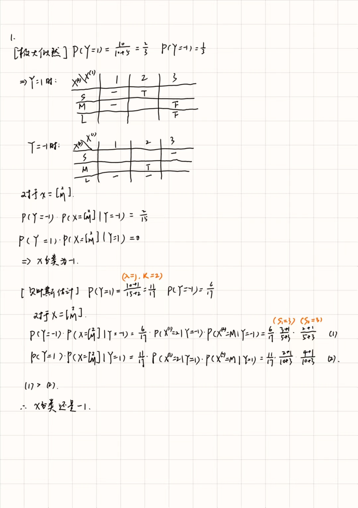

```{r setup, include=FALSE}
knitr::opts_chunk$set(echo = TRUE)
```


## 1. 

使用训练数据学习贝叶斯分类器，分别采用极大似然估计和贝叶斯估计（λ = 1），请同学们写出给定输入 x = (2, M)时的类标记

```{r}

```

## 2. 

完成征信系列-用户行为数据分析。

### 2.1

读入数据并了解各个自变量的含义

```{r}
data <- read.csv("simudata.csv")
summary(data)

```

### 2.2

对变量交易笔数和所有用户行为均值分别绘制违约组和非违约组的对比箱线图，并分析是否违约与这些变量之间的关系，给出解读

```{r}
library(ggplot2)
ggplot(data, aes(x = as.factor(black), y = billnum, fill = as.factor(black))) +
  geom_boxplot() +
  scale_fill_manual(values = c("yellow", "green"), labels = c("非违约", "违约"),name = "") +
  labs(title = "违约组与非违约组交易笔数对比箱线图",
       x = "违约标签",
       y = "交易笔数")

```

```{r}
library(ggplot2)
ggplot(data, aes(x = as.factor(black), y = meanpay, fill = as.factor(black))) +
  geom_boxplot() +
  scale_fill_manual(values = c("yellow", "green"), labels = c("非违约", "违约"),name = "") +
  labs(title = "违约组与非违约组所有用户行为均值对比箱线图",
       x = "违约标签",
       y = "所有用户行为均值")

```

可见违约组的交易笔数和所有用户行为均值整体都低于非违约组。这说明违约组倾向于少次少量的交易。

### 2.3

按照7:3划分训练集和测试集，用决策树模型进行建模（提示：划分数据集时设定随机种子=1234；在R中可使用rpart函数，设置为默认参数）；在测试集上进行测试，绘制ROC曲线，计算AUC值。

```{r}
library(rpart)
library(pROC)

# 将因变量转为因子型
data$black <- as.factor(data$black)

# 划分数据集
set.seed(1234)
ind <- sample(2, nrow(data), replace = TRUE, prob = c(0.7, 0.3)) # 按7:3比例随机生成训练集和测试集
trainset <- data[ind == 1, ] # 训练集
testset <- data[ind == 2, ] # 测试集

# 使用决策树模型进行建模
model <- rpart(black ~ ., data = trainset, method = "class")

# 预测测试集的概率
probabilities <- predict(model, testset, type = "prob")[, 2]
# 将概率转换为因子型，以便于绘制ROC曲线
predictions <- ifelse(probabilities > 0.5, "违约组", "非违约组")

# 绘制ROC曲线
roc_curve <- roc(testset$black, probabilities)
plot(roc_curve, print.thres = TRUE, col = "blue")
# 计算AUC值
auc_value <- auc(roc_curve)
auc_value

```

### 2.4

画出决策树的图形，并进行解读

```{r}
library(rpart.plot)
rpart.plot(model)

```

可见若非最近一次信贷距今 > 184个单位，所有行为均值 < 29000，四大行的消费行为均值 < 536000，用户违约的可能性很小；此后，转账R值 < 186或者借记类F值 >= 76的用户也不太可能违约；
余下的用户则违约可能较大。
